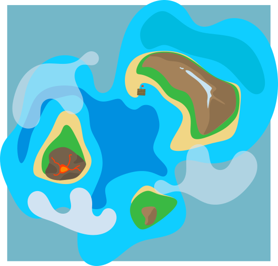
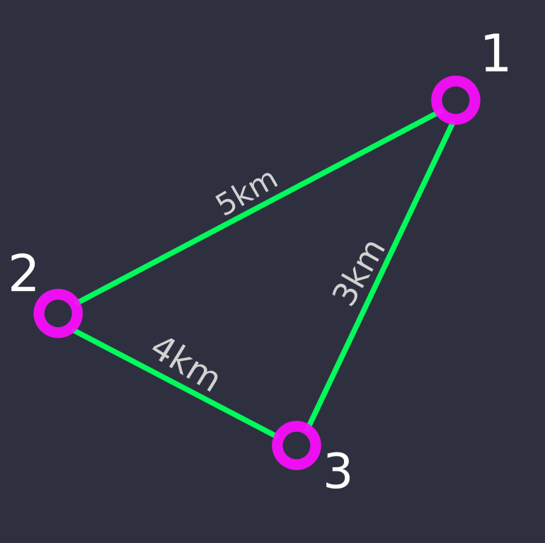

# Introdução aos grafos
## O que são grafos:
Grafos são estruturas simples usadas para representar algum tipo de relação entre objetos.
Usando essas estruturas, é possível representar mapas, arvores de decisão, caminhos entre pontos etc.

Nas imagens abaixo vemos um grafo onde cada nó (numerado de forma arbitraria) representa uma esquina, e cada conexão representa uma rua.

    
    

## Variações de grafos
As conexões entre os nós de um grafo podem sofrer algumas alteções a depender do problema em questão, duas variações importantes para os grafos são:
- Grafos direcionais:
    
São definidos como grafos onde cada conexão só pode ser percorrida em um único sentido.
    O grafo abaixo representa o fluxo de agua do rio, onde as conexões só podem ser percorridas no sentido indicado por setas.

    

    
    
    

- Pesos:
    
Em vários grafos são necessários pesos nas conexões, servindo para representar algum atributo da ligação, como distancia entre objetos, tempo de resposta entre computadores em rede, corrente entre dois componentes de um circuito elétrico, etc.

    

    
    
    
