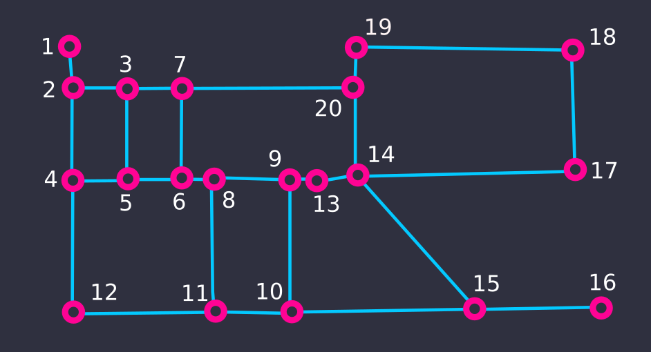

# Menor caminho entre vertices

## Introdução:
A busca de menor caminho é uma questao classica da teoria dos grafos, sendo assim, existem varios algoritmos já criados para resolver esse tipo de problema. Abaixo temos a explicação do algoritmo de Dijkstra, um algoritmo muito usado para resolver esse tipo de problema:

## Dijkstra:
O algoritmo de Dijkstra consiste em, a partir de um vertice inicial, percorrer os vertices adjacentes do vertice atual. Apois percorrer os vertices adjacentes, os mesmos são adicionados num conjunto de vertices percorridos, e a distancia de cada também é guardada. Este processo continua para todos os ultimos vertices percorridos até que todos os caminhos possiveis sejam encontrados.

## Modo não recursivo:
- ### Primeiro passo: Criar o grafo.
    Antes de tudo, é necessário armazenar as informaçõe do grafo, para isso iremos usar uma matriz de adjacencia apresentada na página anterior.<br>
    Nesse algoritmo iremos construir o grafo da figura 2 da página anterior.
    ```python
    # Quantidade de vertices no grafo
    N = 21

    # Foi criado uma matriz quadrada de N x N
    grafo = [[0] * n for _ in range(n)]

    # Definindo uma relacao entre o vertice 0 e o vertice 3. Esta ligação,
    # por sua vez, deve ser interpretada como uma relação unidirecional
    grafo[1][2] = 1
    
    # Podemos tambem definir uma ligação do vertice X para o vertice Y e outra
    # do vertice Y para o X, como um modo de criar um grafo sem direção.
    grafo[1][2] = grafo[2][1] = 1
    grafo[2][3] = grafo[3][2] = 1
    grafo[2][4] = grafo[4][2] = 1
    ...
    ```
    
- ### Segundo passo: Definir as variaveis auxiliares.
    ```python
    # Inicialmente nenhum vertice foi percorrido então iremos definir uma lista
    # com todos os numeros.
    nao_percorridos = list(range(10))

    # È necessário definir um vertice pelo qual a busca será feita, nesse caso
    # o vertice foi definido arbitrariamente como 0.
    atual = 0

    ```
- ### Terceiro passo: Realizar a busca.

    ```python
    # Inicialmente nenhum vertice foi percorrido então iremos definir uma lista
    # com todos os numeros.
    nao_percorridos = list(range(10))

    # È necessário definir um vertice pelo qual a busca será feita, nesse caso
    # o vertice foi definido arbitrariamente como 0.
    atual = 0

    ```
## Modo recursivo:
...